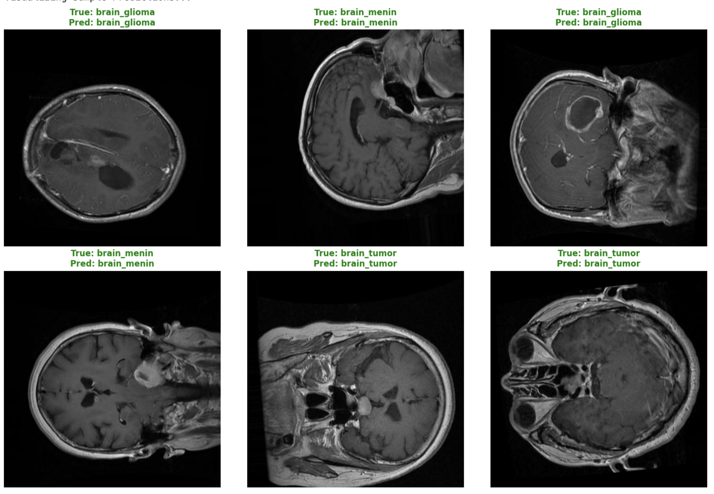

# Brain Tumor Classification using ConvNeXt V2 🧠


## 📌 Project Overview
This project implements a high-performance deep learning model for classifying brain tumors from MRI scans. Utilizing **Transfer Learning** with the **ConvNeXt V2** architecture (specifically `convnextv2-tiny-1k-224`), the model achieves state-of-the-art accuracy in differentiating between three types of brain tumors.

The solution is designed for medical imaging tasks where precision and recall are critical, leveraging the Hugging Face `transformers` library for efficient fine-tuning.

## 📊 Dataset
The model was trained on a dataset containing MRI scans categorized into three classes.
* **Source:** https://www.kaggle.com/datasets/orvile/brain-cancer-mri-dataset
* **Total Images:** ~6,000+
* **Classes:**
    * `brain_glioma`
    * `brain_menin` (Meningioma)
    * `brain_tumor` (Pituitary/General)

*Data Split:* 80% Training / 20% Validation (Stratified)

## 🚀 Methodology
* **Architecture:** ConvNeXt V2 (Tiny) - A modern, pure ConvNet architecture that competes with Vision Transformers.
* **Technique:** Transfer Learning (Fine-tuning pre-trained ImageNet weights).
* **Optimizer:** AdamW with Weight Decay.
* **Loss Function:** Cross Entropy Loss.
* **Image Size:** 224x224 pixels (resized and normalized).

## 🏆 Performance Results
The model was trained for 5 epochs on a GPU (Tesla P100/T4).

**Final Metrics:**
* **Validation Accuracy:** **99.59%**
* **Training Loss:** 0.0002
* **Validation Loss:** 0.0148

### Training History
| Epoch | Training Loss | Validation Loss | Accuracy |
| :---: | :---: | :---: | :---: |
| 1 | 0.1145 | 0.0743 | 97.44% |
| 2 | 0.0295 | 0.0150 | 99.50% |
| 3 | 0.0183 | 0.0349 | 99.26% |
| 4 | 0.0009 | 0.0140 | 99.59% |
| **5** | **0.0002** | **0.0148** | **99.59%** |

### Classification Report
| Class | Precision | Recall | F1-Score | Support |
| :--- | :---: | :---: | :---: | :---: |
| **brain_glioma** | 1.00 | 1.00 | 1.00 | 401 |
| **brain_menin** | 0.99 | 1.00 | 0.99 | 401 |
| **brain_tumor** | 1.00 | 0.99 | 1.00 | 410 |
| **Accuracy** | | | **1.00** | 1212 |

> **Note:** The model achieves perfect or near-perfect identification across all tumor types, minimizing False Negatives which is crucial in medical diagnosis.

## 🛠️ Installation & Usage

### Prerequisites
* Python 3.8+
* GPU recommended for training (NVIDIA T4/P100 or better)

### Install Dependencies
```bash
pip install torch torchvision transformers datasets evaluate scikit-learn accelerate matplotlib
```
### Dataset : https://www.kaggle.com/datasets/orvile/brain-cancer-mri-dataset

### Visual Inference


